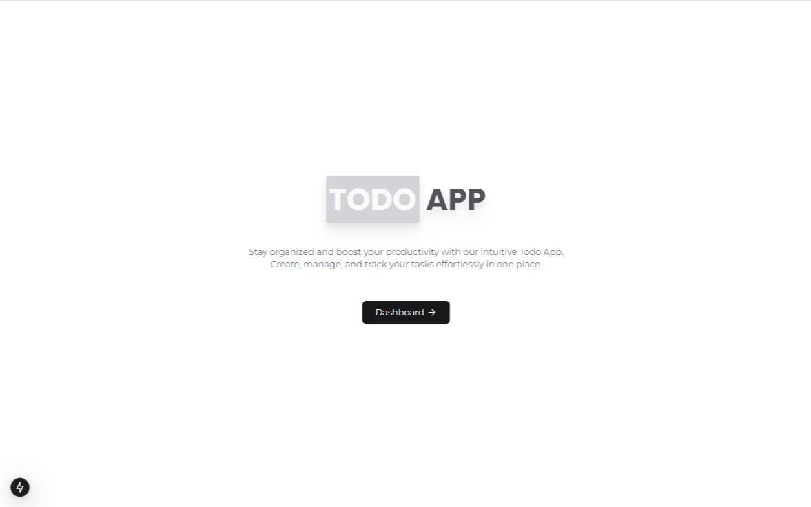
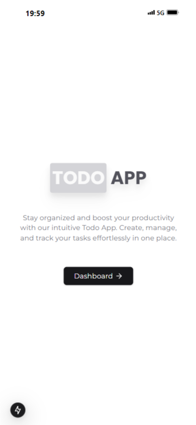

    

<div align="center" style='margin-top:6rem;'>

# Todo App

  <br />
  <a href="#about"><strong>Explore the screenshots »</strong></a>
  <br />
  <br />
  <a href="https://github.com/raphaeleliass/todo-app/issues">Report a Bug</a>
  .
  <a href="https://github.com/raphaeleliass/todo-app/issues">Ask a Question</a>
</div>

<div align="center">
<br />

[](LICENSE)

[](https://github.com/raphaeleliass/todo-app/issues)
[](https://github.com/raphaeleliass)

</div>

<details open="open">
<summary>Table of Contents</summary>

- [About](#about)
  - [Built With](#built-with)
- [Getting Started](#getting-started)
  - [Prerequisites](#prerequisites)
  - [Installation](#installation)
- [Authors & contributors](#authors--contributors)
- [License](#license)

</details>

---

## Descrição

O projeto Todo App é uma aplicação simples e intuitiva que permite aos usuários gerenciar suas tarefas diárias de forma eficiente. Com uma interface amigável, os usuários podem adicionar, editar e remover tarefas, além de marcar aquelas que já foram concluídas. Este aplicativo utiliza o NextJS para uma experiência de usuário dinâmica e responsiva, proporcionando uma maneira prática de organizar suas atividades e aumentar a produtividade.

> Você pode acessar o site clicando [aqui](https://raphaelelias-todo-app.vercel.app)

## Capturas de Tela

<details>
<summary>Veja as capturas de tela do projeto</summary>

<br>

<div align='center'>

### Desktop

  

### Mobile

  
</div>

</details>

### Construído Com

> - NextJS
> - Context Api
> - Firebase
> - TypeScript
> - Tailwindcss

## Começando

### Pré-requisitos

> - NodeJS

### Instalação

> Crie um arquivo <strong>.env</strong> na raiz do projeto com a seguinte estrutura:

```bash
NEXT_PUBLIC_FIREBASE_API_KEY="sua-api-key"
NEXT_PUBLIC_FIREBASE_AUTH_DOMAIN="seu-auth-domain"
NEXT_PUBLIC_FIREBASE_PROJECT_ID="seu-project-id"
NEXT_PUBLIC_FIREBASE_STORAGE_BUCKET="seu-storage-bucket"
NEXT_PUBLIC_FIREBASE_MESSAGING_SENDER_ID="seu-messaging-sender-id"
NEXT_PUBLIC_FIREBASE_APP_ID="seu-app-id"

```

> Em seguida, execute o seguinte comando no terminal do projeto para instalar as dependências:

```bash
npm install 
```

> Por fim, é só executar o seguinte comando e pronto!

```bash
npm run dev
```

## License

This project is licensed under the **MIT license**.

See [LICENSE](LICENSE) for more information.
